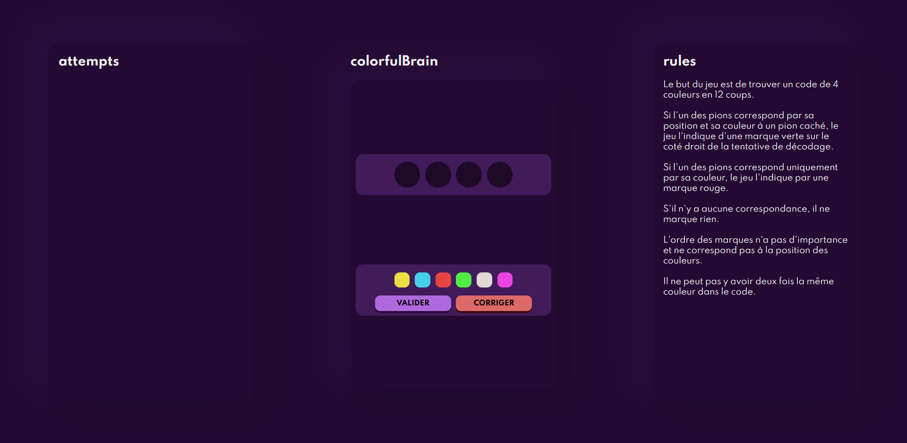

# colorfulBrain
A web version of the popular game MasterMind. 
 

### Why did I do it ?
I did it because it's one of my first javascript exercises, it needs to be refactored and finished, but I'm proud of it because "nostalgia" is getting to me I guess.

### What's good ?
I learning some things with this exercices, i worked hard to the ergonomic aspects and i wanted to be a beautiful interface even if it wasn't requested...
Today, I think it's not very beautiful, but I wanted to share it.

### What's wrong ?
###### User side : 
1. Currently you can't lose
2. You can't restart the game after winning without press F5 key
3. And MediaQueries are not developped
###### Developer side : 
1. The code is not commented.
2. It's developed only in procedural programming.
3. It's a mess in the .css file
4. 
### Rules :
- The goal of the game is to find a 4-color code ~~in 12 moves~~.

- If one of the pieces corresponds by its position and its color to a hidden piece, the game indicates it with a green mark on the right side of the decoding attempt.

- If one of the pieces matches only by color, the game indicates this with a red mark.

- If there is no match, it does not mark anything.

- The __**order**__ of the marks __**is not important**__ and does not correspond to the position of the colors.

- The same color cannot appear twice in the code.
